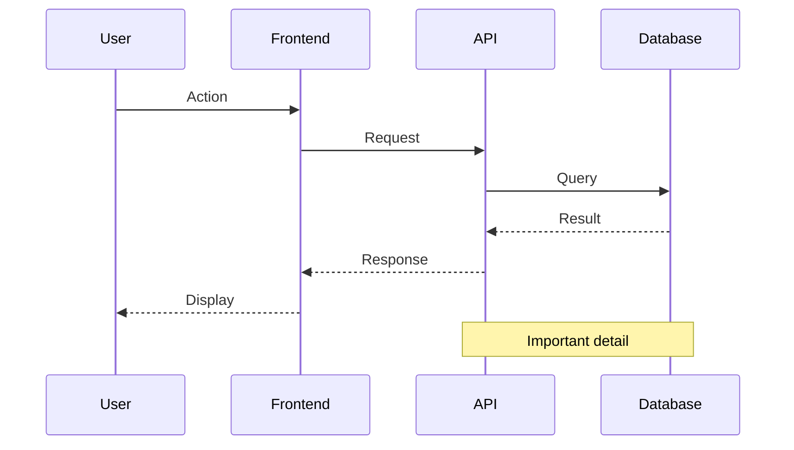
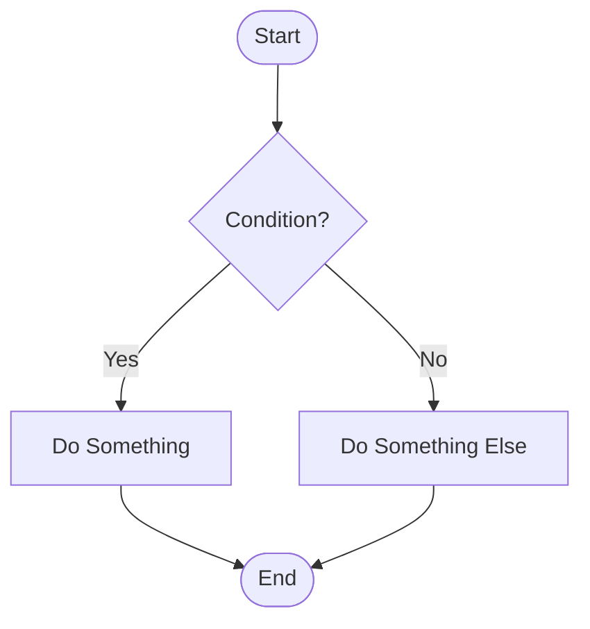

# Mermaid Diagram Generator

Generate interactive, shareable HTML diagrams using Mermaid.js to visualize system flows, sequences, architectures, and technical processes.

## When to Use This Skill

Activate this skill when:
- User asks to "create a diagram", "draw a diagram", "visualize this"
- User says "show me the flow", "how does X work", "what's the sequence"
- User wants to understand system architecture, database relationships, or process flows
- User needs to document workflows, API interactions, or state machines
- User says "turn this into a diagram", "make this visual"
- User is discussing complex interactions that would benefit from visualization

## Core Responsibilities

This skill creates **interactive HTML diagrams** that:

1. **Analyze the Context**: Understand what needs to be visualized (flows, sequences, relationships, states)
2. **Choose Diagram Type**: Select the most appropriate Mermaid diagram type
3. **Generate Mermaid Syntax**: Create accurate, well-structured Mermaid.js code
4. **Create HTML File**: Embed diagram in a standalone, shareable HTML file
5. **Add Documentation**: Include explanatory text, key points, and references

## Supported Diagram Types

### Sequence Diagrams
**Use for**: API calls, user flows, system interactions, webhook flows, authentication processes

**Example triggers**:
- "Show me how the team purchase flow works"
- "Diagram the authentication process"
- "What happens when a webhook fires?"

### Flowcharts
**Use for**: Decision trees, algorithms, process flows, state machines

**Example triggers**:
- "Draw the decision flow for user access"
- "Show the deployment process"
- "Visualize the error handling logic"

### Entity Relationship Diagrams
**Use for**: Database schemas, table relationships, data models

**Example triggers**:
- "Show the database structure"
- "Diagram the relationships between users, teams, and subscriptions"

### Class Diagrams
**Use for**: Object relationships, inheritance hierarchies, system architecture

**Example triggers**:
- "Show the class structure"
- "Diagram the component relationships"

### State Diagrams
**Use for**: State machines, status workflows, lifecycle processes

**Example triggers**:
- "Show the order status flow"
- "Diagram the subscription states"

### Gantt Charts
**Use for**: Project timelines, task scheduling, milestones

**Example triggers**:
- "Create a project timeline"
- "Show the release schedule"

## Adaptive Context Interview (Step 0)

**Before starting any diagram work**, use `AskUserQuestion` to understand the user's needs. This eliminates generic output by tailoring the diagram to the user's specific context, preferences, and intended use.

### Phase A: Purpose (Always Ask)

Use `AskUserQuestion` to ask the user about their diagram's primary purpose:

- **Academic/Scientific** - For papers, theses, journal figures, technical reports
- **Presentation** - For talks, meetings, stakeholder demos, conference slides
- **Documentation** - For codebases, wikis, technical docs, READMEs
- **Quick Sketch** - Just need something fast, minimal fuss

### Phase B: Conditional Follow-ups

Based on the purpose selected:

**If Academic/Scientific:**
- Ask: "Font preference? Serif (Times/Georgia for traditional academic look) or sans-serif (modern scientific style like Nature/Science journals)?"
- Apply the Academic preset from [context-presets.md](references/context-presets.md)

**If Presentation:**
- Ask: "Color preference? Vibrant and bold, professional and muted, or match specific brand colors?"
- Apply the Presentation preset from [context-presets.md](references/context-presets.md)

**If Documentation:**
- Use the default styling (no preset needed)
- Proceed to Phase C

**If Quick Sketch:**
- Skip all further questions
- Use default styling and the standard static template
- Proceed directly to Step 1

### Phase C: Engagement-Gated Customization

If the user gave detailed, engaged answers in Phases A-B, ask ONE more question:

- "Would you like the interactive editor in the HTML output? This adds a sidebar with theme switching, color pickers, font controls, zoom, and export to PNG/SVG — plus you can click individual nodes to change their colors, double-click to edit text, and Shift+click to resize."

**If yes:** Use the interactive template from [interactive-template.md](references/interactive-template.md)
**If no or skipped:** Use the standard static template from Step 5 below

### Phase D: Context Questions

Ask about the diagram content (combine with Phase A if efficient):
- What specific flow/process should be visualized?
- What level of detail is needed? (high-level overview vs detailed implementation)
- Are there specific components or actors that must be included?
- What's the output file name preference?

### Interview Rules

- **Maximum 3-4 questions total.** Combine related questions into single AskUserQuestion calls.
- **If the user says "just make it"**, stop asking and proceed with sensible defaults.
- **Adapt to engagement level.** Terse answers = fewer follow-ups. Detailed answers = offer more options.
- **Never re-ask** what's already clear from the conversation context.

---

## Instructions

### Step 1: Understand the Context

Ask clarifying questions if needed:
- What specific flow/process should be visualized?
- What level of detail is needed? (high-level overview vs detailed implementation)
- Are there specific components or actors that must be included?
- What's the output file name preference?

### Step 2: Gather Information

Use available tools to understand the system:

```bash
# Read relevant files to understand the flow
Read <file_path>

# Search for related code
Grep <pattern>

# Find related files
Glob <pattern>
```

**Important**: Base the diagram on actual code, not assumptions.

### Step 3: Choose Diagram Type

Select based on what's being visualized:

| What to Visualize | Diagram Type |
|-------------------|--------------|
| API calls, webhooks, async flows | Sequence Diagram |
| Decision logic, algorithms | Flowchart |
| Database tables, relationships | ER Diagram |
| Component architecture | Class Diagram |
| Status changes, workflows | State Diagram |
| Project timeline | Gantt Chart |

### Step 4: Create Mermaid Syntax

Write clear, well-structured Mermaid code:

**Sequence Diagram Template**:


**Flowchart Template**:


**See [diagram-examples.md](references/diagram-examples.md) for more templates.**

### Step 5: Generate HTML File

Create a standalone HTML file with:

```html
<!DOCTYPE html>
<html lang="en">
<head>
    <meta charset="UTF-8">
    <meta name="viewport" content="width=device-width, initial-scale=1.0">
    <title>Descriptive Title</title>
    <script src="https://cdn.jsdelivr.net/npm/mermaid@10/dist/mermaid.min.js"></script>
    <style>
        body {
            font-family: -apple-system, system-ui, sans-serif;
            max-width: 1400px;
            margin: 0 auto;
            padding: 20px;
            background: #f5f5f5;
        }
        h1 { color: #333; text-align: center; }
        .diagram-container {
            background: white;
            border-radius: 8px;
            padding: 30px;
            box-shadow: 0 2px 8px rgba(0,0,0,0.1);
        }
        .key-points {
            background: white;
            border-radius: 8px;
            padding: 20px;
            margin-top: 20px;
            box-shadow: 0 2px 8px rgba(0,0,0,0.1);
        }
    </style>
</head>
<body>
    <h1>Title</h1>
    <div class="diagram-container">
        <div class="mermaid">
            <!-- Mermaid diagram code here -->
        </div>
    </div>

    <div class="key-points">
        <h2>Key Points</h2>
        <!-- Explanatory content here -->
    </div>

    <script>
        mermaid.initialize({
            startOnLoad: true,
            theme: 'default'
        });
    </script>
</body>
</html>
```

### Step 6: Add Documentation

Include in the "Key Points" section:
1. **Phase breakdowns** (if applicable)
2. **Important details** about each step
3. **File paths** referenced in the diagram
4. **Why this design** (architectural decisions)
5. **Trade-offs** or considerations

### Step 7: Save and Confirm

**File naming convention**:
- Use descriptive, kebab-case names
- Example: `team-purchase-flow.html`, `auth-sequence.html`, `database-schema.html`

**Default location**: Project root or as specified by user

After creating:
1. Verify the HTML file was created successfully
2. Tell the user the file path
3. Mention they can open it in any browser
4. Summarize what the diagram shows

## Output Format

```
📊 Diagram created: /path/to/diagram-name.html

The diagram shows:
- [Brief description of what's visualized]
- [Number of actors/components/states]
- [Key phases or sections]

Open the file in your browser to view the interactive diagram.
```

## Best Practices

1. **Keep it Clear**: Don't overcrowd diagrams - break complex flows into multiple diagrams
2. **Use Phases**: For long sequences, use `Note over` to mark distinct phases
3. **Label Clearly**: Use descriptive participant names, not technical IDs
4. **Add Context**: Include notes for important decisions or state changes
5. **Style Consistently**: Use consistent arrow types, colors, and formatting
6. **Document Well**: The key points section should explain the diagram
7. **Real Data**: Base diagrams on actual code, not assumptions

## Common Patterns

### When user says "show me the flow for X"
1. Read relevant files to understand X
2. Choose sequence diagram for process flows
3. Break into phases (setup → action → result)
4. Generate HTML with phase annotations

### When user says "diagram the database"
1. Read schema files or migrations
2. Choose ER diagram
3. Show tables, columns, and relationships
4. Document key constraints

### When user says "visualize the architecture"
1. Read component files
2. Choose class diagram or flowchart
3. Show high-level components and their relationships
4. Document architectural decisions

## Mermaid Configuration

Use these settings for best results:

```javascript
mermaid.initialize({
    startOnLoad: true,
    theme: 'default',
    sequence: {
        diagramMarginX: 50,
        diagramMarginY: 10,
        actorMargin: 80,
        width: 200,
        height: 65,
        boxMargin: 10,
        messageMargin: 35,
        mirrorActors: true,
        useMaxWidth: true
    },
    flowchart: {
        useMaxWidth: true,
        htmlLabels: true,
        curve: 'basis'
    }
});
```

## Related Files

- [diagram-examples.md](references/diagram-examples.md) - Templates for each diagram type
- [mermaid-syntax-guide.md](references/mermaid-syntax-guide.md) - Complete Mermaid syntax reference
- [styling-guide.md](references/styling-guide.md) - HTML/CSS customization options
- [interactive-template.md](references/interactive-template.md) - Full interactive HTML template with editor sidebar
- [context-presets.md](references/context-presets.md) - Academic and Presentation preset configurations

## Important Notes

- **Always use Read/Grep/Glob**: Base diagrams on actual code, not assumptions
- **Browser-ready**: HTML files should work standalone without setup
- **Mobile-friendly**: Use responsive design and readable fonts
- **Accessible**: Include alt text and semantic HTML
- **Shareable**: Files should be self-contained (no external dependencies except Mermaid CDN)

---

## Interactive HTML Template

When the user opts for the interactive editor (via the Adaptive Context Interview), use the template from [interactive-template.md](references/interactive-template.md) instead of the standard static template in Step 5.

### What the Interactive Template Provides

The interactive template generates an HTML file with a **sidebar editor** that includes:

- **Page Theme** - Switch between Light and Dark page backgrounds
- **Diagram Style** - Change the Mermaid diagram color scheme (Default, Dark, Neutral, Forest)
- **Global Color Palette** - Color pickers for primary, secondary, and accent colors
- **Font Selector** - Choose between sans-serif, serif, and monospace fonts
- **Font Size Control** - Adjustable slider (10-24px)
- **Zoom Control** - Scale the diagram from 50% to 200% with scrollable container
- **Per-Node Editing** - Click any node to change its fill color, border color, or shape (Rectangle, Rounded, Diamond, Circle, Stadium)
- **Inline Text Editing** - Double-click any node to edit its label text
- **Node Resize** - Shift+click to cycle through size options (80%, 100%, 120%, 150%)
- **Edge/Arrow Editing** - Click any arrow to change its style (solid/dotted/thick), edit its label, or re-route it to different nodes
- **Edge Label Editing** - Double-click any arrow label to edit it inline
- **Export** - Save as PNG (full diagram, not clipped) or SVG
- **Auto-Save** - All customizations persist in localStorage

### When to Use Interactive vs Static

| Scenario | Template |
|----------|----------|
| User requested interactive editor | Interactive (from interactive-template.md) |
| User selected Academic or Presentation preset | Interactive with preset applied |
| User selected Quick Sketch | Static (from Step 5) |
| User selected Documentation (default) | Static (from Step 5) |
| User didn't specify preference | Static (from Step 5) |

### Applying Context Presets

When using a preset with the interactive template:

1. Add the preset class to `<body>` (e.g., `class="preset-academic"`)
2. Include the preset's CSS from [context-presets.md](references/context-presets.md)
3. Set the JavaScript default state values to match the preset defaults
4. Initialize sidebar controls with preset values

See [context-presets.md](references/context-presets.md) for full preset configurations.

### Diagram Type Compatibility

Per-node interactive features (click-to-edit colors, text editing, resize) work best with **flowcharts**, **class diagrams**, **state diagrams**, and **ER diagrams**. For **sequence diagrams**, **Gantt charts**, **git graphs**, and **mindmaps**, the editor gracefully provides global controls only (theme, colors, fonts, zoom, export).

### Output Format (Interactive)

```
Diagram created: /path/to/diagram-name.html

The diagram shows:
- [Brief description of what's visualized]
- [Number of actors/components/states]
- [Key phases or sections]

Interactive features:
- Use the sidebar to change theme, colors, fonts, and zoom
- Click nodes to edit individual colors
- Double-click nodes to edit text labels
- Shift+click nodes to resize
- Export as PNG or SVG from the sidebar
- Your changes are auto-saved

Open the file in your browser to view and customize the diagram.
```
